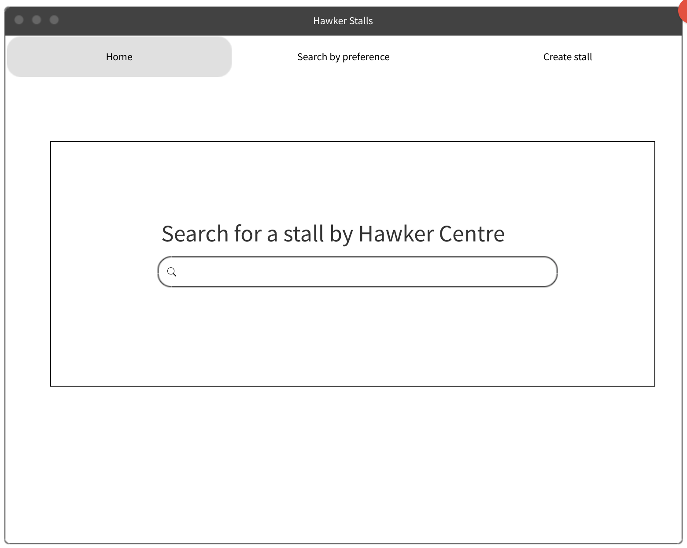

# Python and Data Centric Development - Milestone Project 3

 
### A website to find out more information and to give reviews on hawker stalls in Singapore

# Table of Contents
1. Background
2. Objectives
3. Demo
4. Adopted Technology
5. User Stories
6. Development
7. Implementation
8. Testing
9. Deployment
10. Acknowledgement

# 1. Background
For many people, food is something we need to survive. For some, however, food is something they love
and they are always in search of good food that are affordable and recommended by many.
In Singapore, we have the luxury of enjoying a variety of different cuisines that are made by people of different
cultures and races. All these food can easily be found in hawker centres that house multiple stalls at one location. 
However, the information on some of these stalls, for example, location, opening hours, specialty, etc are not always
readily available on the web. Even if they are, the quality and deliciousness of the food are a mystery, unless it 
is mentioned in the media or on social media. To close this gap, The Hawker-rant provides a platform on which database-stored 
information on these hawker stalls are readily available. Users of this website are able to find information on these
stalls and they can give their honest reviews, to allow others to gauge the popularity and quality of these stalls.

# 2. Objectives
* To complete Milestone Project 3 - Python and Data Centric Development
* To build a data centric website that allows user to create, read, update and delete information, which will in turn be useful to other users
* To provide a platform that hosts useful information for the intended audience

# 3. Demo
View the end product: [The Hawker-rant](https://farhan-thehawkerrant.herokuapp.com/)

# 4. Adopted Technology
* HTML/CSS for UI/UX
* Bootstrap v5.0.x for responsiveness
* Python/flask for web framework
* MongoDB for NoSQL database
* Stackoverflow for coding tips
* Canva for image edits
* Cloudinary for hosting images
* FreeLogoDesign for logo generation
* MockFlow for wireframes
* Github for version control
* Heroku for deployment

# 5. User Stories
The target audience for the website are food-lovers and people who just need information or opinion on hawker food. 
Some of the user stories are:

1. I want to search for a particular hawker stall
2. I want to know what are the stalls available in a particular hawker centre
3. I want to search for a hawker stall based on my preference
4. I want to find out more information on a hawker stall
5. I want to create new stall, update and delete existing stall
6. I want to see reviews on the hawker stalls
7. I want to add a review, edit and delete existing reviews

# 6. Development
Wireframe for respective webpages:

1. Home page


2. Search results


3. Display page


Wireframe for Website Structure


# 7. Implementation
Screenshot of actual webpages:

1. Home page
   <br>
   The home page serves to be the central page that connects to all other pages.
   It also serves to answer to the following user stories:
   ```
    2. I want to know what are the stalls available in a particular hawker centre
    ```
   

2. Create stall page
   <br>
   This page serves to answer to the following user stories:
   ```
    5. I want to create new stall
    ```
   

3. Results page
   <br>
   This page serves to answer to following user stories:
   ```
    1. I want to search for a particular hawker stall
    3. I want to search for a hawker stall based on my preference
    4. I want to find out more information on a hawker stall
    ```
   
   <br>
    The "view" button allows the user to be redirected to the display page which will contain more information 
    regarding the stall

4. Display page
    <br>
   This page serves to answer to following user stories:
   ```
    4. I want to find out more information on a hawker stall
    5. I want to create new stall, update and delete existing stall
    6. I want to see reviews on the hawker stalls
    7. I want to add a review, edit and delete existing reviews
    ```
   
   <br>
   The display page links the user to many other user action such as to edit and delete stall as well as
   to add, edit and delete review.


# 8. Testing

## Test Table

| Test Type | Test | Result | Error Fix |
|:---------:|:-------------:|:-------------:|:-------------:|
| Functionality | Test navbar links among all pages | All links work | NA |
| Functionality | Test links on buttons in all pages | Some links do not work | Some render_template or redirect actions do not work due to missing parameters. Troubleshoot and rectified by ensuring correct parameters are passed where needed.|
| Data Management | Test query from MongoDB | Some queries do not work as expected due to wrong syntax | Rectified by correcting syntax |
| Functionality | Test submit/search/update/delete of forms | Form submission do not work at times due to wrong methods used | Use POST or GET wherever appropriate |
| Usability | Test search engine whether string input matches value in database | Search engine works with minimal issues | NA |
| Usability | Test user input validation by entering invalid condition in input field | Input field managed to prompt error message | NA |
| Usability | Test whether previous value entered into input field can be retained if form submission fail | Some old values were unable to be retrieved | Rectified by correcting syntax |
| Responsiveness | Test responsiveness of button locations when browser is resized using Google Chrome inspect element | Buttons are able to relocate at location that is user-friendly | NA |
| Responsiveness | Test responsiveness of images and columns using Google Chrome inspect element | Images are resized and columns are restacked | NA |
| Data Management | Test whether data is able to be transferred to database when form is submitted  | Data transfer successful | NA |
| Data Management | Checked that key-value pairs are consistent within respective collection | NA | NA |

## Bug Testing
### HTML
   HTML files were passed through W3C Nu HTML. Major errors were rectified.
   
    
### CSS
   CSS file was passed through Jigsaw CSS. No errors found.
   
   
### PEP8
   Python file was passed through PEP8 online checker. No errors found.
   


# 9. Deployment
* Link to published website: ()
* Link to source code: ()

# 10. Acknowledgement
* Trent Global College for providing the platform for learning.
* Code Institute for their TAs, namely:
  * Paul Chor
  * Ace
 
* [Stackoverflow](https://stackoverflow.com/) for coding tips
* [DanielFoodDiary](https://danielfooddiary.com/) for hawker stall information
* [Canva](https://www.canva.com/) for images used in the website.
* [Bootstrap](https://getbootstrap.com/) for HTML and CSS templates.
* [w3schools](https://www.w3schools.com/) for basic HTML/CSS/Javascript/Jquery syntax references.
